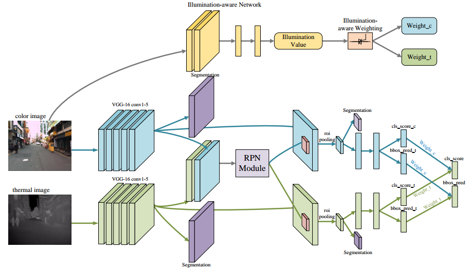
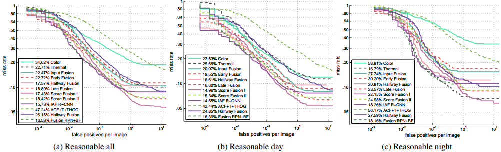

### Illumination-aware Faster R-CNN for Robust Multispectral Pedestrian Detection
Editted by Chengyang Li, Zhejiang University.



### Detection performance



**Note**: 
Since the original annotations of the test set contain many problematic bounding boxes, we use the [improved testing annotations](http://paul.rutgers.edu/%7Ejl1322/multispectral.htm) provided by Liu et al. to enable a reliable comparison.

### Downloads

[Detection results](https://drive.google.com/open?id=1PcD-w24P3vuDqOppQZwSANmyaSvdRrDc)

### Citing our paper
If you find our work useful in your research, please consider citing:

```
@article{li2019illumination,
  title={Illumination-aware Faster R-CNN for Robust Multispectral Pedestrian Detection},
  author={Li, Chengyang and Song, Dan and Tong, Ruofeng and Tang, Min},
  journal={Pattern Recognition},
  volume={85C},
  pages={161-171},
  year={2019},
  publisher={Elsevier}
}
```

